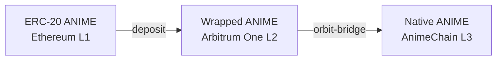
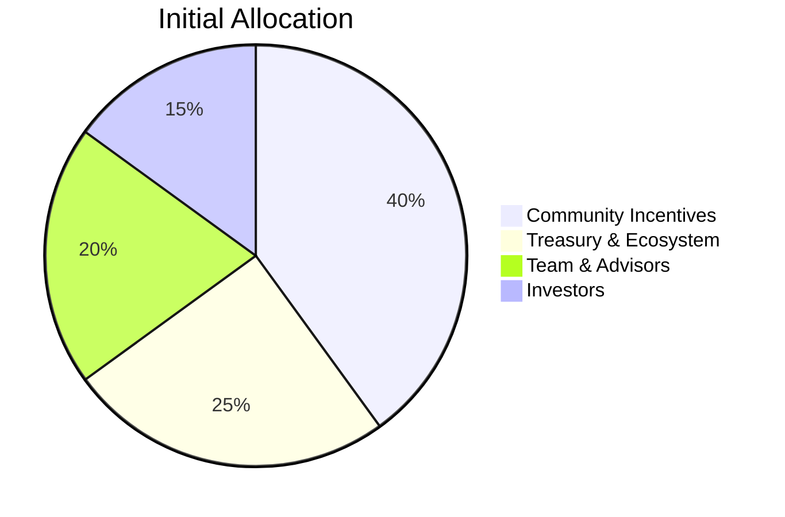

# ANIME Token Overview

Everything you need to know about **ANIME** – the native token powering the AnimeChain ecosystem.

---

## 🪙 Token at a Glance

| Attribute            | Mainnet                          | Testnet (tANIME)               |
|----------------------|----------------------------------|--------------------------------|
| **Symbol**           | ANIME                            | tANIME                         |
| **Decimals**         | 18                               | 18                             |
| **Total Supply**     | 1,000,000,000 ANIME *(fixed)*    | Unlimited (for testing)        |
| **Contract (L1)**    | `0x...` *(Ethereum)*            | —                              |
| **Contract (L2)**    | `0x...` *(Arbitrum One)*        | —                              |
| **Native (L3)**      | Built-in gas token              | `tANIME`                       |
| **Bridgeable**       | Yes (L1 ⇄ L2 ⇄ L3)              | N/A                            |

> Final contract addresses will be published after mainnet launch.

---

## 🌐 Token Journey Across Layers

1. **L1 → L2:** Users deposit ANIME into the Arbitrum Bridge, minting wrapped ANIME on Arbitrum One.
2. **L2 → L3:** Wrapped ANIME is deposited via the Orbit Bridge, minting native ANIME on AnimeChain.
3. **Gas Use:** On AnimeChain, ANIME is a native token (like ETH on Ethereum) — it pays gas directly.

---

## 🔄 Bridging Paths

| Direction | Tool / Contract | Estimated Time | Fees |
|-----------|-----------------|----------------|------|
| L1 → L2   | Arbitrum Bridge | ~10 min        | L1 gas |
| L2 → L3   | Orbit Bridge    | ~1 min         | negligible |
| L3 → L2   | Orbit Bridge (withdraw) | 7 days challenge | negligible |
| L2 → L1   | Arbitrum Bridge (withdraw) | 7 days challenge | L1 gas |

See the [Bridging Guide](bridging.md) for step-by-step instructions.

---

## 💸 Utility & Use-Cases

- **Gas Fees:** Every tx on AnimeChain is paid in ANIME.
- **dApps Payments:** DEX fees, NFT mints, games.
- **Governance (future):** Planned on-chain voting & treasury.

---

## 🔐 Security & Audits

All bridge and token contracts will undergo audits by leading firms before mainnet launch. Audit reports will be linked here once available.

---

## 📈 Token Economics Snapshot

*(Preliminary — subject to DAO approval.)*

---

## 📄 Contract Addresses (preview)

| Layer | Contract | Address | Status |
|-------|----------|---------|--------|
| L1 | ANIME ERC-20 | `0x...` | 🚧 deploying |
| L2 | Bridge Inbox | `0x...` | 🚧 deploying |
| L3 | Token Faucet | `0xFauc3...` | ✅ testnet |

---

## ➡️ Next

1. **[Bridging Guide](bridging.md)** – Move tokens across layers.
2. **[Developer Docs](../developers/index.md)** – Integrate ANIME in your dApp.
3. **[FAQ](../resources/faq.md)** – Common questions answered. 