  <h1>AnimeChain Documentation</h1>
  
<strong>Layer 3 Blockchain Built on Arbitrum Orbital</strong>

  
Get funds immediately via the faucet

  <a href="networks/testnet/faucet" class="faucet-btn">
    🚰
    Testnet Faucet
  </a>

---

  <button class="main-action-btn" onclick="showDevelopSection()">
    
    Develop on AnimeChain
    Build applications and smart contracts
  </button>
  
  <a href="use-animechain" class="main-action-btn">
    
    Use AnimeChain
    Add network, check balances, and manage tokens
  </a>

  <h2>🛠️ Development Environment</h2>
  
Choose your preferred development network:

  
  

    <a href="networks/testnet/getting-started" class="develop-btn">
      
🧪

      
Testnet

      
Safe testing environment with free tokens

    </a>
    
    <a href="networks/mainnet/getting-started" class="develop-btn">
      
🟢

      
Mainnet

      
Production-ready network for live applications

    </a>
  

---

# Architecture Overview

AnimeChain is built as a **Layer 3 blockchain** using Arbitrum Orbital technology:

```mermaid
graph TB
    L1[Ethereum L1<br/>🏦 Animecoin Origin]
    L2[Arbitrum L2<br/>🌉 Wrapped ANIME]
    L3[AnimeChain L3<br/>🎌 Native ANIME]
    
    L1 -->|Bridge| L2
    L2 -->|Bridge| L3
    
    L1_DESC[Original ANIME token<br/>Ethereum mainnet]
    L2_DESC[Wrapped ANIME<br/>Lower fees, faster tx]
    L3_DESC[Native gas token<br/>Anime-focused ecosystem]
    
    L1 --- L1_DESC
    L2 --- L2_DESC
    L3 --- L3_DESC
    
    style L3 fill:#ff6b9d,stroke:#333,stroke-width:3px
    style L2 fill:#4ecdc4,stroke:#333,stroke-width:2px
    style L1 fill:#45b7d1,stroke:#333,stroke-width:2px
```

### Key Benefits

- **Rollup-of-a-rollup cost savings**: AnimeChain is an L3 rollup that batches on Arbitrum (which itself batches on Ethereum), further reducing per‑transaction cost versus using Arbitrum directly.
- **Native ANIME for everything**: **ANIME** is the base gas and settlement currency chain‑wide, minimizing ERC‑20 overhead and enabling consistently fast throughput.
- **Larger contracts (≈45 KB)**: Deploy feature‑rich contracts up to ~45 KB, avoiding the ~20–25 KB limits common on L1/L2 and reducing the need for proxies or contract splits.
- **Fast inbound bridging (L1 → L2 → L3)**: Funding AnimeChain from Ethereum or Arbitrum propagates quickly via canonical bridges. See the [Bridging guide](animecoin/bridging.md).
- **Longer native exits (L3 → L2 → L1)**: Withdrawing back to Arbitrum follows optimistic rollup timing similar to withdrawals on `bridge.arbitrum.io` from Arbitrum to Ethereum; use liquidity bridges when available for faster exits.
- **Security inheritance**: Benefits from Arbitrum and Ethereum security guarantees.

#### Rollup-of-a-rollup (visual)

  <canvas id="chainCanvas" width="1000" height="1050" aria-label="Chains visualization" style="max-width:100%; width:100%; height:1050px; display:block; border-radius:8px; background: radial-gradient(ellipse at top left, rgba(255,255,255,0.06), rgba(0,0,0,0.02));"></canvas>

---

## 🚀 Quick Start

### For Users
1. [Add AnimeChain to your wallet](networks/mainnet/add-to-wallet.md)
2. [Bridge ANIME tokens](animecoin/bridging.md) from L1/L2
3. Start using anime dApps on L3!

### For Developers
1. [Set up your development environment](developers/index.md)
2. [Deploy smart contracts](developers/contracts.md)
3. [Integrate with our RPC](developers/rpc-api.md)
4. [Explore code examples](developers/examples.md)

### For Testers
1. [Connect to testnet](networks/testnet/getting-started.md)
2. [Get free test tokens](networks/testnet/faucet.md)
3. [Try our interactive tools](app.md)

---

## 🛠️ Developer Resources

-   :material-rocket-launch: **Quick Start**

    ---

    Get up and running with AnimeChain in minutes

    [:octicons-arrow-right-24: Get Started](developers/index.md)

-   :material-code-braces: **Smart Contracts**

    ---

    Core contracts, ABIs, and deployment guides

    [:octicons-arrow-right-24: View Contracts](developers/contracts.md)

-   :material-api: **RPC API**

    ---

    Complete API reference and examples

    [:octicons-arrow-right-24: API Docs](developers/rpc-api.md)

-   :material-tools: **Interactive Tools**

    ---

    Test contracts and transactions in your browser

    [:octicons-arrow-right-24: Try Tools](app.md)

---

## 🪙 Animecoin (ANIME)

**ANIME** is the native token powering the AnimeChain ecosystem:

| Layer | Token Type | Use Case |
|-------|------------|----------|
| **L1 (Ethereum)** | ERC-20 ANIME | Original token, governance |
| **L2 (Arbitrum)** | Wrapped ANIME | Lower fees, DeFi |
| **L3 (AnimeChain)** | Native ANIME | Gas fees, native ecosystem |

[Learn more about ANIME →](animecoin/index.md){ .md-button }

---

## 🤝 Community & Support

-   :fontawesome-brands-github: **GitHub**

    ---

    View source code and contribute

    [:octicons-arrow-right-24: AnimeChain GitHub](https://github.com/AnimeChain)

-   :fontawesome-brands-discord: **Discord**

    ---

    Join our developer community

    [:octicons-arrow-right-24: Join Discord](https://discord.gg/animechain)

-   :material-help-circle: **Support**

    ---

    Get help and troubleshooting

    [:octicons-arrow-right-24: Get Help](resources/troubleshooting.md)

-   :material-frequently-asked-questions: **FAQ**

    ---

    Common questions and answers

    [:octicons-arrow-right-24: View FAQ](resources/faq.md)

---

!!! tip "Need Help?"
    New to AnimeChain? Start with our [Getting Started Guide](networks/mainnet/getting-started.md) or try our [Interactive Tools](app.md) to explore the network safely.
