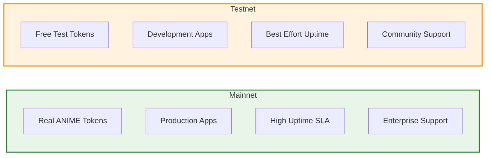

# Networks Overview

AnimeChain operates on two networks to serve different use cases:

## 🟢 Mainnet - Production Ready

**AnimeChain Mainnet** is the production network where real value transactions occur.

- **Purpose:** Production applications and real asset transfers
- **Security:** Full security guarantees from Arbitrum and Ethereum
- **Tokens:** Real ANIME tokens with actual value
- **Uptime:** Enterprise-grade reliability

[Mainnet Documentation →](mainnet/getting-started.md){ .md-button .md-button--primary }

---

## 🧪 Testnet - Safe Development

**AnimeChain Testnet** is the development network for testing and experimentation.

- **Purpose:** Development, testing, and learning
- **Security:** Same security model as mainnet, but with test tokens
- **Tokens:** Free test tokens from our faucet
- **Reset:** Network may be reset during development

[Testnet Documentation →](testnet/getting-started.md){ .md-button }

---

## Choosing the Right Network

| Feature | Mainnet | Testnet |
|---------|---------|---------|
| **Purpose** | Production apps | Development & testing |
| **Tokens** | Real ANIME tokens | Free test tokens |
| **Uptime** | Production SLA | Best effort |
| **Data Persistence** | Permanent | May be reset |
| **Gas Fees** | Real cost | Free (test tokens) |
| **Support** | Enterprise support | Community support |

---

## Network Comparison

---

!!! warning "Important"
    Always start development on **Testnet** before deploying to **Mainnet**. Testnet provides a safe environment to test your applications without risking real assets.

!!! tip "Getting Started"
    - **New to AnimeChain?** Start with [Testnet Getting Started](testnet/getting-started.md)
    - **Ready for production?** Move to [Mainnet Getting Started](mainnet/getting-started.md)
    - **Need test tokens?** Visit our [Faucet](testnet/faucet.md) 