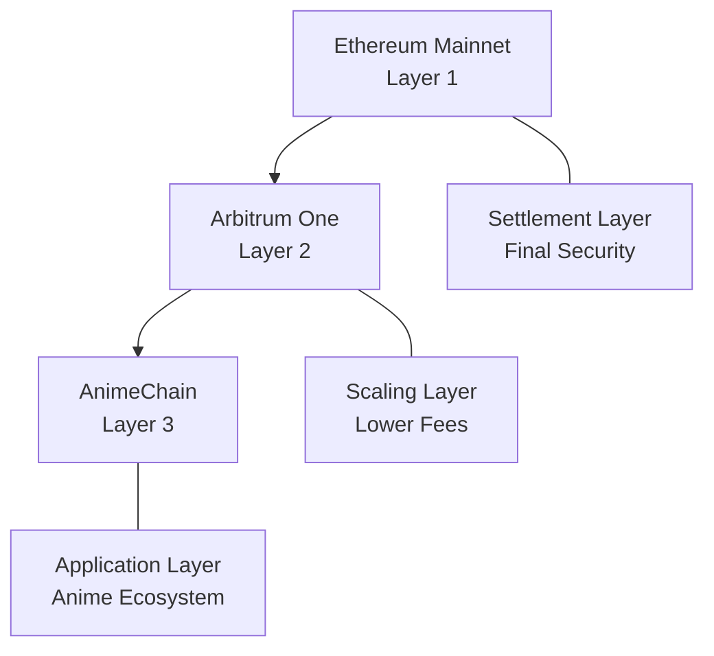

# AnimeChain Mainnet Network Details

Complete technical reference for AnimeChain Mainnet - everything developers need to integrate with the production network.

## 🌐 Network Configuration

### Core Network Information

| Property | Value | Hex |
|----------|-------|-----|
| **Network Name** | AnimeChain | - |
| **Chain ID** | 69000 | 0x10D88 |
| **Native Currency** | ANIME | - |
| **Currency Decimals** | 18 | - |
| **Block Time** | ~2 seconds | - |
| **Finality** | Instant (soft), ~7 days (hard) | - |

### Network URLs

| Service | URL | Status |
|---------|-----|--------|
| **RPC HTTP** | `https://rpc-animechain-39xf6m45e3.t.conduit.xyz/` | ✅ Active |
| **RPC WebSocket** | `wss://rpc-animechain-39xf6m45e3.t.conduit.xyz/` | ✅ Active |
| **Block Explorer** | `https://explorer-animechain-39xf6m45e3.t.conduit.xyz/` | ✅ Active |
| **Bridge Interface** | Coming Soon | 🚧 Development |

---

## 🏗️ Infrastructure Details

### Layer Architecture



### Parent Chain Information

| Property | Value |
|----------|--------|
| **Parent Chain** | Arbitrum One |
| **Parent Chain ID** | 42161 |
| **Settlement** | Ethereum Mainnet |
| **Security Model** | Inherited from Arbitrum |

---

## 📜 System Contracts

### Core Protocol Contracts

!!! info "Contract Addresses"
    These are the core system contracts that power AnimeChain. Most developers won't interact with these directly.

| Contract | Address | Purpose |
|----------|---------|---------|
| **Rollup** | `0x...` | Main rollup contract on parent chain |
| **Inbox** | `0x...` | Message passing from parent to child |
| **Outbox** | `0x...` | Message passing from child to parent |
| **Bridge** | `0x...` | Token bridging functionality |
| **Sequencer Inbox** | `0x...` | Transaction sequencing |

### Native Token Contracts

| Contract | Address | Chain | Purpose |
|----------|---------|--------|---------|
| **ANIME (L1)** | `0x...` | Ethereum | Original ERC-20 token |
| **ANIME (L2)** | `0x...` | Arbitrum One | Bridged token |
| **ANIME (L3)** | Native | AnimeChain | Native gas token |

---

## 🔧 RPC API Reference

### Standard JSON-RPC Methods

AnimeChain supports all standard Ethereum JSON-RPC methods:

=== "Basic Methods"

    ```javascript
    // Get chain ID
    await provider.send('eth_chainId', []);
    // Returns: "0x10d88" (69000)

    // Get latest block
    await provider.send('eth_getBlockByNumber', ['latest', false]);

    // Get balance
    await provider.send('eth_getBalance', [address, 'latest']);

    // Send transaction
    await provider.send('eth_sendRawTransaction', [signedTx]);
    ```

=== "Transaction Methods"

    ```javascript
    // Get transaction by hash
    await provider.send('eth_getTransactionByHash', [txHash]);

    // Get transaction receipt
    await provider.send('eth_getTransactionReceipt', [txHash]);

    // Get transaction count (nonce)
    await provider.send('eth_getTransactionCount', [address, 'latest']);

    // Estimate gas
    await provider.send('eth_estimateGas', [txObject]);
    ```

=== "Contract Methods"

    ```javascript
    // Call contract method
    await provider.send('eth_call', [
      {
        to: contractAddress,
        data: encodedData
      },
      'latest'
    ]);

    // Get contract code
    await provider.send('eth_getCode', [contractAddress, 'latest']);

    // Get storage at position
    await provider.send('eth_getStorageAt', [contractAddress, position, 'latest']);
    ```

### Gas Configuration

| Parameter | Value | Note |
|-----------|-------|------|
| **Gas Limit (Block)** | 30,000,000 | Per block gas limit |
| **Gas Price (Min)** | 0.1 gwei | Minimum gas price |
| **Gas Price (Typical)** | 0.1-1 gwei | Normal network conditions |
| **Max Priority Fee** | 0 gwei | No priority fees |

### Performance Metrics

| Metric | Value | Comparison |
|--------|-------|------------|
| **Block Time** | ~2 seconds | Faster than Ethereum (~12s) |
| **TPS** | ~1,000+ | Higher than Ethereum (~15) |
| **Finality** | Instant (soft) | Immediate for most purposes |
| **Hard Finality** | ~7 days | Full Ethereum security |

---

## 🔐 Security & Consensus

### Security Model

AnimeChain inherits security from its parent chains:

```
🔒 Security Inheritance:
Ethereum (Full Security)
    ↓
Arbitrum One (Optimistic Rollup)
    ↓
AnimeChain (Arbitrum Nitro)
```

### Consensus Mechanism

- **Sequencer-based ordering** for fast transaction processing
- **Optimistic fraud proofs** for security validation
- **Challenge period** of ~7 days for withdrawals
- **Decentralized validation** through Arbitrum's validator network

### Bridge Security

!!! warning "Bridge Security Notice"
    When bridging assets between layers:
    
    - **L3 → L2 withdrawals** have a ~7-day challenge period
    - **Fast withdrawals** may be available through third-party services
    - **Always verify** contract addresses before interacting

---

## 💰 Economics & Gas

### Gas Token Economics

| Aspect | Details |
|--------|---------|
| **Gas Token** | ANIME (native) |
| **Gas Price** | Dynamic, typically 0.1-1 gwei |
| **Block Gas Limit** | 30,000,000 |
| **EIP-1559** | Supported (baseFee + tip) |

### Cost Comparison

Typical transaction costs compared to other networks:

| Transaction Type | AnimeChain | Arbitrum One | Ethereum |
|------------------|------------|--------------|----------|
| **Simple Transfer** | ~$0.001 | ~$0.01 | ~$5-50 |
| **ERC-20 Transfer** | ~$0.002 | ~$0.02 | ~$10-80 |
| **DEX Swap** | ~$0.01 | ~$0.10 | ~$50-200 |
| **NFT Mint** | ~$0.005 | ~$0.05 | ~$20-100 |

---

## 🛠️ Development Tools

### Supported Tools

All Ethereum development tools work with AnimeChain:

=== "Frameworks"
    - ✅ **Hardhat** - Smart contract development
    - ✅ **Foundry** - Fast, portable toolkit
    - ✅ **Truffle** - Development framework
    - ✅ **Remix** - Web-based IDE

=== "Libraries"
    - ✅ **ethers.js** - Ethereum library
    - ✅ **web3.js** - Web3 library  
    - ✅ **viem** - TypeScript library
    - ✅ **wagmi** - React hooks

=== "Wallets"
    - ✅ **MetaMask** - Browser extension
    - ✅ **WalletConnect** - Mobile wallets
    - ✅ **Coinbase Wallet** - Coinbase's wallet
    - ✅ **Rainbow** - Mobile-first wallet

### Network Configuration Examples

=== "Hardhat"

    ```javascript
    // hardhat.config.js
    require('@nomiclabs/hardhat-ethers');

    module.exports = {
      solidity: "0.8.20",
      networks: {
        animechain: {
          url: "https://rpc-animechain-39xf6m45e3.t.conduit.xyz/",
          chainId: 69000,
          accounts: [process.env.PRIVATE_KEY],
          gasPrice: 100000000, // 0.1 gwei
        }
      }
    };
    ```

=== "Foundry"

    ```toml
    # foundry.toml
    [profile.default]
    src = "src"
    out = "out"
    libs = ["lib"]

    [rpc_endpoints]
    animechain = "https://rpc-animechain-39xf6m45e3.t.conduit.xyz/"

    [etherscan]
    animechain = { key = "${ETHERSCAN_API_KEY}", url = "https://explorer-animechain-39xf6m45e3.t.conduit.xyz/" }
    ```

=== "ethers.js"

    ```javascript
    import { ethers } from 'ethers';

    const provider = new ethers.JsonRpcProvider(
      "https://rpc-animechain-39xf6m45e3.t.conduit.xyz/"
    );

    // Verify connection
    const network = await provider.getNetwork();
    console.log(`Connected to ${network.name} (${network.chainId})`);
    ```

=== "viem"

    ```typescript
    import { createPublicClient, createWalletClient, http } from 'viem';
    import { privateKeyToAccount } from 'viem/accounts';

    const animeChain = {
      id: 69000,
      name: 'AnimeChain',
      network: 'animechain',
      nativeCurrency: {
        decimals: 18,
        name: 'ANIME',
        symbol: 'ANIME',
      },
      rpcUrls: {
        public: { http: ['https://rpc-animechain-39xf6m45e3.t.conduit.xyz/'] },
        default: { http: ['https://rpc-animechain-39xf6m45e3.t.conduit.xyz/'] },
      },
      blockExplorers: {
        default: { 
          name: 'AnimeChain Explorer', 
          url: 'https://explorer-animechain-39xf6m45e3.t.conduit.xyz/' 
        },
      },
    } as const;

    const publicClient = createPublicClient({
      chain: animeChain,
      transport: http(),
    });
    ```

---

## 📊 Monitoring & Analytics

### Block Explorer Features

The AnimeChain Explorer provides:

- **Transaction tracking** - Real-time transaction monitoring
- **Block information** - Detailed block data and statistics
- **Contract verification** - Source code verification
- **Token analytics** - ERC-20/ERC-721 token information
- **Address analytics** - Account activity and balance tracking

### Network Status

Monitor network health:

| Metric | Endpoint | Example |
|--------|----------|---------|
| **Latest Block** | `eth_blockNumber` | Returns current block height |
| **Gas Price** | `eth_gasPrice` | Returns current gas price |
| **Peer Count** | `net_peerCount` | Returns connected peers |
| **Syncing Status** | `eth_syncing` | Returns sync status |

---

## 🚀 Next Steps

### For Developers

1. **[Add Network to Wallet](add-to-wallet.md)** - Set up your development environment
2. **[Get ANIME Tokens](../../animecoin/bridging.md)** - Bridge tokens for gas
3. **[Deploy Your First Contract](../../developers/examples.md)** - Start building
4. **[Verify on Explorer](../../developers/contracts.md)** - Make your code public

### For Users

1. **[Wallet Setup Guide](add-to-wallet.md)** - Configure your wallet
2. **[Bridge ANIME](../../animecoin/bridging.md)** - Get tokens for transactions
3. **[Explore dApps](../../resources/faq.md)** - Find anime-focused applications

---

!!! tip "Need Help?"
    - 💬 **DevZuki Community:** [Join here](https://t.co/4xlpVFIfDx) — community-led developer support; docs maintained by a DevZuki member
    - 📚 **Developer Docs:** [API Reference](../../developers/rpc-api.md)
    - 🛠️ **Interactive Tools:** [Developer Dashboard](../../app.md)
    - 🐛 **Issues:** [GitHub](https://github.com/AnimeChain/AnimeChainDev/issues) 