# TODO: MkDocs + React App Integration

## 🏗️ Architecture Overview & Context

### **Dual-Website System Explanation**

This project implements a **hybrid documentation + interactive application system** where:

1. **MkDocs serves as the primary website** at `/` (root)
2. **React SPA is embedded as a sub-application** at `/app/`
3. **Both share the same domain** to avoid CORS issues
4. **Documentation can seamlessly link to interactive tools**

### **How It Works Technically**

```
📁 AnimeChain Documentation Site Architecture:

🌐 Domain Root (/)
├── 📚 MkDocs Static Site (Primary)
│   ├── / (Homepage)
│   ├── /networks/mainnet/getting-started/
│   └── ... (All documentation pages)
│
└── ⚛️ React SPA (Embedded at /app/)
    ├── /app/ (React Router handles all sub-routes)
    ├── /app/faucet (Interactive faucet interface)
    ├── /app/wallet-setup (Network configuration)
    └── /app/* (All React app functionality)
```

### **Build Process Flow**

```mermaid
graph TB
    A[Source Code] --> B[Build Docs First]
    B --> C[docs/site/ Generated]
    C --> D[Build React App]
    D --> E[React SPA → docs/site/app/]
    E --> F[Complete Integrated Site]
    
    subgraph "Final Structure"
        G[docs/site/index.html - MkDocs Homepage]
        H[docs/site/networks/ - Documentation Pages]
        I[docs/site/app/index.html - React SPA Entry]
        J[docs/site/app/assets/ - React Assets]
    end
    
    F --> G
    F --> H
    F --> I
    F --> J
```



### **Key Technical Decisions**

1. **Build Order:** `docs → app` (MkDocs first, then React)
   - **Why:** MkDocs cleans `docs/site/` directory, so React must build after
   - **Implementation:** `npm run build:all` = `build:docs && build:app`

2. **React SPA Mode:** `ssr: false` in `react-router.config.ts`
   - **Why:** SPA mode generates standalone `index.html` that works in any directory
   - **Benefit:** Can be embedded in MkDocs without server-side dependencies

3. **Base Path Configuration:** `/app/` for all React assets
   - **React Router:** `basename: "/app"` 
   - **Vite:** `base: "/app/"`
   - **Result:** All React routes and assets work under `/app/` subdirectory

4. **Directory Preservation:** `emptyOutDir: false`
   - **Why:** Prevents React build from deleting MkDocs files
   - **Effect:** Both websites coexist in `docs/site/`
